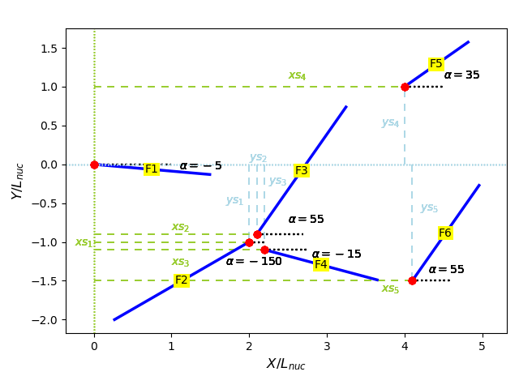
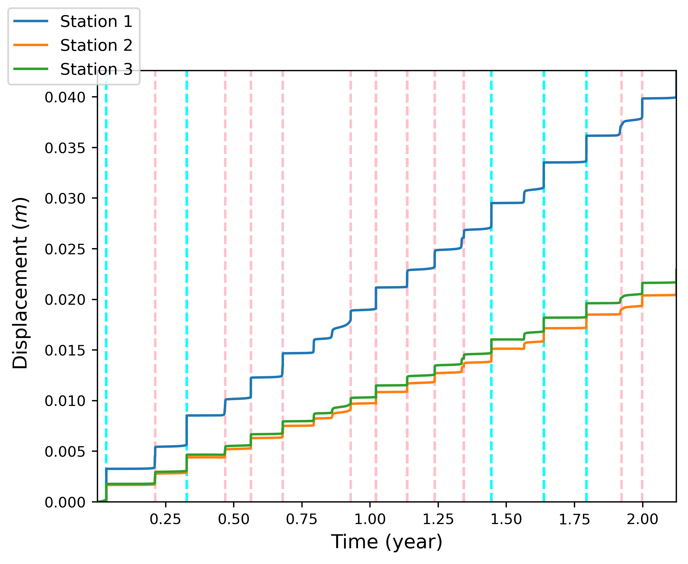

# PythonFastCycles 

This is a Python package to interact with the the Fortran code *FastCycles*.      
*FastCycles* has been developped by Pierre Romanet during his PhD thesis under the direction of R. Madariaga and H. Bhat.     
See Romanet et al. (2018). [[1]](#1)

## Install

You can install the lastest version of *PythonFastCycles* using pip.    
Run in a terminal:         
`pip install PythonFastCycles`

## How to use

### Create files for a simulation 

#### Defines path to a simulation folder
`path = 'path/to/fastcycles/problems/' `

#### Defines parameters
```python
fric_law = 'RateStateAgeing_R'
frac_mode = 'ModeIII'

mu = 3e10 
Dc = 1e-3
sigma_N = -1e8
a = 0.0075
b = 0.01
```

The lenght of the fault L is defined with the ratio L/L<sub>nuc</sub> (L<sub>nuc</sub> is computed automatically).      

`L_over_Lnuc = 2`

Defines &sigma;

```python
s11 = 0.0
s22 = 0.0
s33 = 0.0
s12 = 0.0
s13 = 0.0
s23 = 0.1

sigma_dot = np.array([[s11, s12, s13], [s12, s22, s23], [s13, s23, s33]])
```

#### Create a simulation 'test'

First initialise the simulation 

```python
test = Simulation(path, 'Test', mu, a, b, fric_law=fric_law, frac_mode=frac_mode, sigma_N=sigma_N, Dc=Dc)
```

You can thus create all files (*i.e.* config.in, geometry.in, GPS.in and tides.in) using :   

```python
test.create_all_files(L_over_Lnuc, sigma_dot, geom_type='1fault')
```
Parameters that can be parse to this function:
*   *geom_type* specifies the geometry of your fault system. For now you can only choose from:
    - "1fault", a geometry with a single fault of length L defines with L/L<sub>nuc</sub>
    - "2faults_overlapping", the geometry of Romanet et al. (2018), *GRL*. You can then specify:
        + D/L<sub>nuc</sub> with D_over_Lnuc
        + the overlap (L/(2L<sub>nuc</sub> in the figure below) the parameter overlap

      <p align="center">
        
      </p>
    - "multiple", a geometry with multiple faults defined with a length, an angle and the distance in x and y of one edge from the first fault
         + *lengths* is a vector with the lengths of the faults normalised by Lnuc (L/L<sub>nuc</sub>). It has size *n*, with *n* the number of fault.
         + *angles* is a vector with the orientation of the faults. The angle is positive in the trigonometric direction. It has size *n*.
         + *xs* is the distance in x normalized by L<sub>nuc</sub> between the edge defining the fault and the first fault. Hence it has size n-1.
         + *ys* is the distance in y normalized by L<sub>nuc</sub> between the edge defining the fault and the first fault. Hence it has size n-1.

      <p align="center">
        
      </p>
      
*   *stop_crit* can be 0, 1 or 2.
  - *stop_crit* = 0: simulation will stop after the first event
  - *stop_crit* = 1: simulation will stop after *max_it* iterations
  - *stop_crit* = 2: simulation will stop at *final_time*

*   *GPSx* and *GPSy*, two lists with the GPS stations coordinates. By default there is only one GPS station at (10, 10).
*   *Tampli*, *Tperiod*, *Tphase*, three lists uses to impose tides. By default there is no tides.
*   *Vval_x1* and *Vval_x2*, x coordinates delimiting the portion on the fault on which the initial perturbation is imposed
*   *Vval_pourc*, the amplitude of the perturbation 

Instead of creating all files at once, you can choose to create just one file.    
The following code lines are doing exactly the same thing as: 
```python 
test.create_all_files(L_over_Lnuc, sigma_dot, geom_type='1fault', stop_crit=1, max_it=10000)
```

```python
# Creates tides.in with default values of tides (i.e. no tides)
test.create_tides_file()
# Creates GPS.in with default values (one GPS station at (10, 10))
test.create_GPS_file()
# Creates geometry.in for a single fault 
test.create_geom_1fault(0, test.Lnuc * test.L_over_Lnuc)
# Creates config.in file with default values 
test.create_config_file(sigma_dot)
```
When you create a geometry, you can add the argument `show=True` to the function to plot the geometry. 

### Reading and processing simulation data 

First we need to read output files:

```python
Test = ReadData(path/to/simulation/folder)
```
#### Plot the geometry of the fault system:
```python
Test.plot_geometry()
````
<p align="center">
  
</p>

By default axis are normalised by L<sub>nuc</sub> but you can add the argument ```scale='X'``` to have coordinates in meters.

#### Plot the maximum velocity for all faults:
```python
Test.plot_max_vel()
```
<p align="center">
  
</p>

You can choose the location of horizontal earthquake and SSE limits with `eql` and `ssel` arguments. Default is `eql=1e-3, ssel=1e-8`.

#### Plot slip rate evolution
```python
Test.plot_slip_rate()
```
<p align="center">
  
</p>

With `vmask` you can specify a value under which all data will be display as white.

#### Plot moment rate evolution
```python
Test.plot_moment_rate()
```
<p align="center">
  
</p>

#### Plot GPS rate evolution
```python
Test.plot_GPS_rate()
```
<p align="center">
  
</p>

#### Plot GPS displacements
```python
Test.plot_GPS_disp()
```
<p align="center">
  
</p>

By default all GPS stations are plot in the save graph. With the argument `plot_type='each'` each GPS station will be displayed in a subplot.

#### Aditional arguments
 * For all this functions, to plot data between a and b indices you can specify a `start=a` and/or a `stop=b` argument(s).
 * By default figures are saved in the simulation directory. You can specify `savefig=False` is you don't want to save them.

### Fixing simulations' problems

Sometimes, the maximum slip rate in 'MomentRate.out' is '-Infinity' and the moment rate is 'nan'. It is due to a wrong tolerance criteria for the adaptive time step. For the moment there is no way to know it before running the simulation, and it has to be manually modified afterwards. The tolerance criteria is denoted as *tol_solver* and can be set in 'config.in'.     
The class FixSimulations check if simulations have '-Infinity' maximum slip rate and can modify the tolerance criteria.     
All you have to do is:
```python
fix = FixSimulations(path, simunames)
```
with *path* the path to the simulations directory and *simunames* a list with the names of the simulations to check.   
For example:
```python
simunames= ['simu1', 'simu2', 'simu3']
```
You will then be asked if you want to automatically change *tol_solver*. Press *y* to do so and press *y* again to relaunch simulations.   
*tol_solver* will be decreased by an order of magnitude but it might not be sufficient. You can thus redo the manipulation to decrease it further down.   

If you press *n* you will exit the function but you can still find the simulations that need to be changed using:
```python
fix.simu_affected
```

### Miscellaneous functions
#### find_simunames

`find_simunames(path, regex)` finds all simulations in the directory `path` matching the expression `regex`. For example:
```python
find_simunames(path, '^simu3\d')
```
will search all simulations with name starting by 'simu3' and a digit (simu30, simu31, ..., simu39).   
You can type `help(find_simunames)` to see common regex syntax.
## References
<a id="1">[1]</a> 
Romanet et al. (2018). 
ast and slow slip events emerge due to fault geometrical complexity. 
*Geophysical Research Letters*, 45(10), pp.4809-4819
https://doi.org/10.1029/2018GL077579
